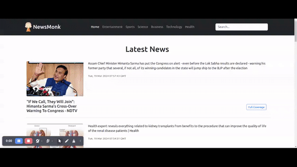

# NewsMonk

News Monk is a simple news site built in React, allowing users to read the latest news and filter them by various categories. It utilizes the [newsapi.org](https://newsapi.org/) API for fetching news data.



## Installation

- Clone the repository:

```bash
  git clone https://github.com/swapnilghone/newsmonk.git
```
- Navigate to the project directory:
```bash
  cd newsmonk
```
- Install dependencies:
```bash
  npm install
```
## Usage/Examples

- Create an account on [newsapi.org](https://newsapi.org/) and Generate the API Key
- Create ```.env.local``` file under newsmonk directory
- Define API key in .env.local file
```
REACT_APP_NEWS_API = 'YOUR_API_KEY'
```
- To start the project:
```bash
npm run start
```
- To build the project:
```bash
npm run build
```


## Dependencies
- Node version: >=20.11.0
- Npm version: >=0.39.1
- React version: 18.2
- React Router DOM version: 6.21
## License

NewsMonk is licensed under the MIT License - see the [LICENSE.TXT](LICENSE.TXT) file for details


## Authors

**Swapnil Ghone** - [NewsMonk](https://github.com/swapnilghone/newsmonk)


## 🔗 Links
[](https://github.com/swapnilghone)

[](https://www.linkedin.com/in/swapnil-ghone/)

## Contributing

Contributions are always welcome!

Please feel free to fork the repository and submit pull requests.